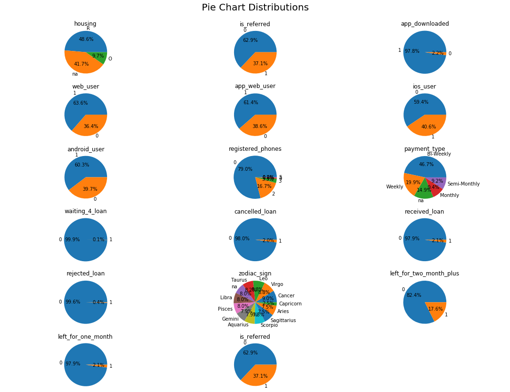
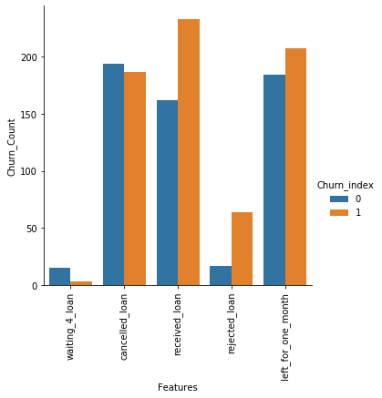
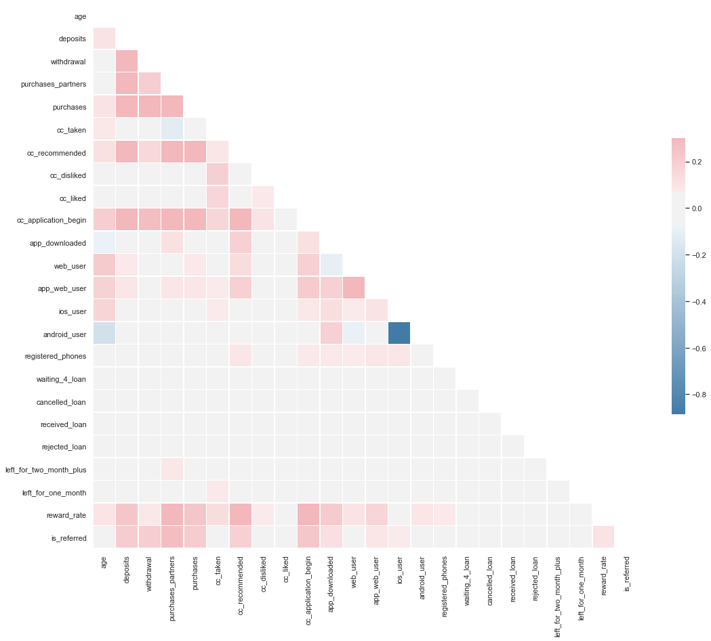
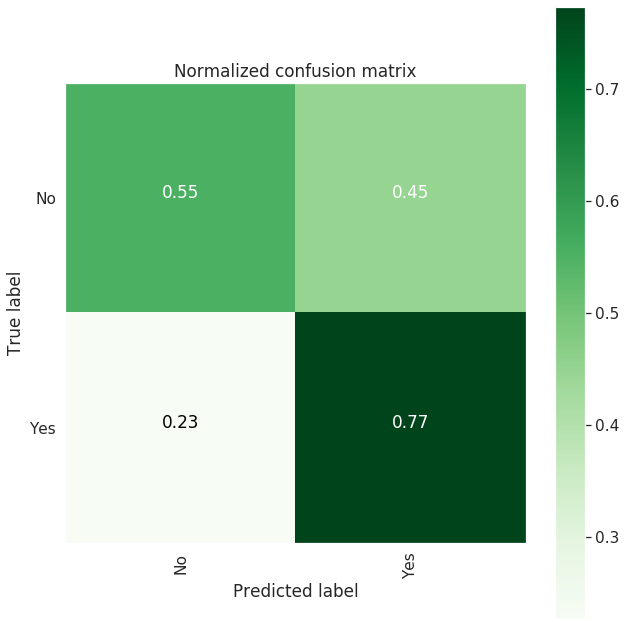
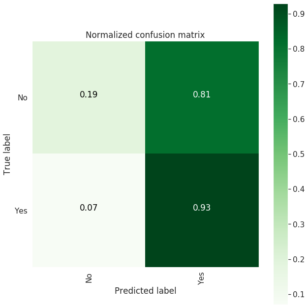
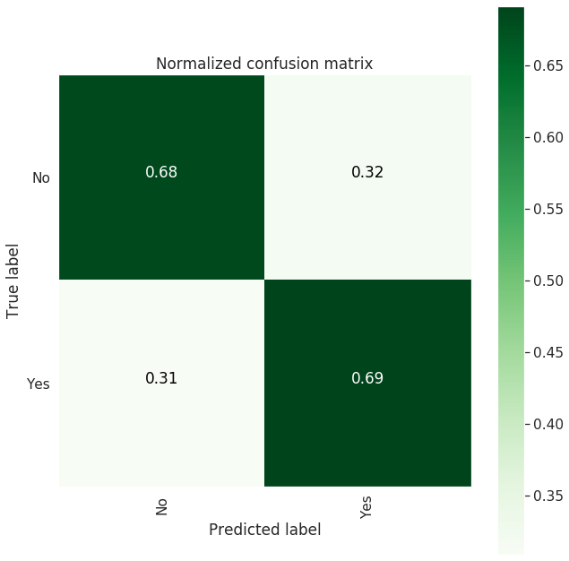
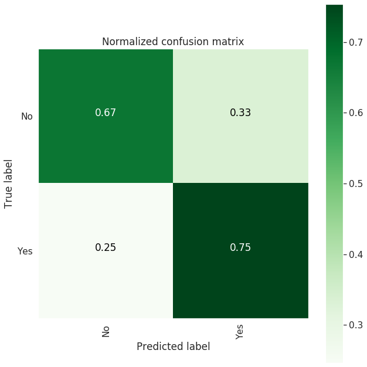
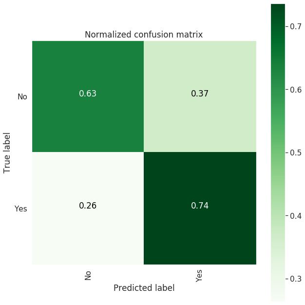

# 1. Business Problem:

We are looking at a subscription model business for a bank where subscription is the primary source of revenue with different sources.
The companies try to minimize the customer churn - Cancel subscription to retain their customers. In this business problem, we will
look into customer behavior pattern to know the disengagement pattern with the product

## 1.1 Problem statement


The object is to know which users are like to cancel the subscription. It will help to focus on re-engaging these users with the product.
It can be a generic e-mail to explain the benefits of products, focus on user value. We need to careful to only connect with users who will stay with reminder, not leave after the reminder.


## 1.2 Source

Data is shared for learning and doesn't reperesnt real customer in any form

## 1.3 Business objective / Constraints

- Cost of misclassification (churn or not churn) is high
- No strict Latency 
- Interpretability is important for Marketing / Product Managers

----------------

# 2. Machine Learning Problem 

As it is clear, we would like to use ML in this business problem.

## 2.1 Type of Machine Learning Problem

It is a classic case of classification problem - to be precise, it's a case of binary classification. 

## 2.2 Performance metrics

We would like to be measure how accuracte is our model and also how precise it is. Mainly, Would like to see <b>F-1 Score</b> as metrics

## 2.3 Data


```python
#### Importing Libraries ####

import pandas as pd
import matplotlib.pyplot as plt
import numpy as np
import seaborn as sns
import warnings
warnings.filterwarnings('ignore')

dataset = pd.read_csv('churn_data.csv') 
```


```python
dataset.head()
```


<div>
<style scoped>
    .dataframe tbody tr th:only-of-type {
        vertical-align: middle;
    }

    .dataframe tbody tr th {
        vertical-align: top;
    }

    .dataframe thead th {
        text-align: right;
    }
</style>
<table border="1" class="dataframe">
  <thead>
    <tr style="text-align: right;">
      <th></th>
      <th>user</th>
      <th>churn</th>
      <th>age</th>
      <th>housing</th>
      <th>credit_score</th>
      <th>deposits</th>
      <th>withdrawal</th>
      <th>purchases_partners</th>
      <th>purchases</th>
      <th>cc_taken</th>
      <th>...</th>
      <th>waiting_4_loan</th>
      <th>cancelled_loan</th>
      <th>received_loan</th>
      <th>rejected_loan</th>
      <th>zodiac_sign</th>
      <th>left_for_two_month_plus</th>
      <th>left_for_one_month</th>
      <th>rewards_earned</th>
      <th>reward_rate</th>
      <th>is_referred</th>
    </tr>
  </thead>
  <tbody>
    <tr>
      <td>0</td>
      <td>55409</td>
      <td>0</td>
      <td>37.0</td>
      <td>na</td>
      <td>NaN</td>
      <td>0</td>
      <td>0</td>
      <td>0</td>
      <td>0</td>
      <td>0</td>
      <td>...</td>
      <td>0</td>
      <td>0</td>
      <td>0</td>
      <td>0</td>
      <td>Leo</td>
      <td>1</td>
      <td>0</td>
      <td>NaN</td>
      <td>0.00</td>
      <td>0</td>
    </tr>
    <tr>
      <td>1</td>
      <td>23547</td>
      <td>0</td>
      <td>28.0</td>
      <td>R</td>
      <td>486.0</td>
      <td>0</td>
      <td>0</td>
      <td>1</td>
      <td>0</td>
      <td>0</td>
      <td>...</td>
      <td>0</td>
      <td>0</td>
      <td>0</td>
      <td>0</td>
      <td>Leo</td>
      <td>0</td>
      <td>0</td>
      <td>44.0</td>
      <td>1.47</td>
      <td>1</td>
    </tr>
    <tr>
      <td>2</td>
      <td>58313</td>
      <td>0</td>
      <td>35.0</td>
      <td>R</td>
      <td>561.0</td>
      <td>47</td>
      <td>2</td>
      <td>86</td>
      <td>47</td>
      <td>0</td>
      <td>...</td>
      <td>0</td>
      <td>0</td>
      <td>0</td>
      <td>0</td>
      <td>Capricorn</td>
      <td>1</td>
      <td>0</td>
      <td>65.0</td>
      <td>2.17</td>
      <td>0</td>
    </tr>
    <tr>
      <td>3</td>
      <td>8095</td>
      <td>0</td>
      <td>26.0</td>
      <td>R</td>
      <td>567.0</td>
      <td>26</td>
      <td>3</td>
      <td>38</td>
      <td>25</td>
      <td>0</td>
      <td>...</td>
      <td>0</td>
      <td>0</td>
      <td>0</td>
      <td>0</td>
      <td>Capricorn</td>
      <td>0</td>
      <td>0</td>
      <td>33.0</td>
      <td>1.10</td>
      <td>1</td>
    </tr>
    <tr>
      <td>4</td>
      <td>61353</td>
      <td>1</td>
      <td>27.0</td>
      <td>na</td>
      <td>NaN</td>
      <td>0</td>
      <td>0</td>
      <td>2</td>
      <td>0</td>
      <td>0</td>
      <td>...</td>
      <td>0</td>
      <td>0</td>
      <td>0</td>
      <td>0</td>
      <td>Aries</td>
      <td>1</td>
      <td>0</td>
      <td>1.0</td>
      <td>0.03</td>
      <td>0</td>
    </tr>
  </tbody>
</table>
<p>5 rows × 31 columns</p>
</div>


### 2.3.1 Data Column details

- userid - MongoDB userid
- churn  - Active = No | Suspended < 30 = No Else Churn = Yes
- age - age of the customer
- city - city of the customer
- state- state where the customer lives
- postal_code - zip code of the customer
- zodiac_sign- zodiac sign of the customer
- rent_or_own - Does the customer rents or owns a house 
- more_than_one_mobile_device - does the customer use more than one mobile device
- payFreq- Pay Frequency of the cusomter
- in_collections - is the customer in collections
- loan_pending - is the loan pending
- withdrawn_application - has the customer withdrawn the loan applicaiton 
- paid_off_loan- has the customer paid of the loan
- did_not_accept_funding - customer did not accept funding
- cash_back_engagement - Sum of cash back dollars received by a customer / No of days in the app
- cash_back_amount - Sum of cash back dollars received by a customer
- used_ios- Has the user used an iphone
- used_android - Has the user used a android based phone
- has_used_mobile_and_web - Has the user used mobile and web platforms
- has_used_web - Has the user used MoneyLion Web app
- has_used_mobile - as the user used MoneyLion  app
- has_reffered- Has the user referred
- cards_clicked - How many times a user has clicked the cards
- cards_not_helpful- How helpful was the cards
- cards_helpful- How helpful was the cards
- cards_viewed- How many times a user viewed the cards
- cards_share- How many times a user shared his cards
- trivia_view_results-How many times a user viewed trivia results
- trivia_view_unlocked- How many times a user viewed trivia view unlocked screen
- trivia_view_locked - How many times a user viewed trivia view locked screen
- trivia_shared_results- How many times a user shared trivia results 
- trivia_played - How many times a user played trivia 
- re_linked_account- Has the user re linked account
- un_linked_account - Has the user un linked account
- credit_score - Customer's credit score

----------------------------------------------

# 3. Exploration Data Analysis (EDA)


```python
# Viewing the Data

dataset.head(5)
```


<div>
<style scoped>
    .dataframe tbody tr th:only-of-type {
        vertical-align: middle;
    }

    .dataframe tbody tr th {
        vertical-align: top;
    }

    .dataframe thead th {
        text-align: right;
    }
</style>
<table border="1" class="dataframe">
  <thead>
    <tr style="text-align: right;">
      <th></th>
      <th>user</th>
      <th>churn</th>
      <th>age</th>
      <th>housing</th>
      <th>credit_score</th>
      <th>deposits</th>
      <th>withdrawal</th>
      <th>purchases_partners</th>
      <th>purchases</th>
      <th>cc_taken</th>
      <th>...</th>
      <th>waiting_4_loan</th>
      <th>cancelled_loan</th>
      <th>received_loan</th>
      <th>rejected_loan</th>
      <th>zodiac_sign</th>
      <th>left_for_two_month_plus</th>
      <th>left_for_one_month</th>
      <th>rewards_earned</th>
      <th>reward_rate</th>
      <th>is_referred</th>
    </tr>
  </thead>
  <tbody>
    <tr>
      <td>0</td>
      <td>55409</td>
      <td>0</td>
      <td>37.0</td>
      <td>na</td>
      <td>NaN</td>
      <td>0</td>
      <td>0</td>
      <td>0</td>
      <td>0</td>
      <td>0</td>
      <td>...</td>
      <td>0</td>
      <td>0</td>
      <td>0</td>
      <td>0</td>
      <td>Leo</td>
      <td>1</td>
      <td>0</td>
      <td>NaN</td>
      <td>0.00</td>
      <td>0</td>
    </tr>
    <tr>
      <td>1</td>
      <td>23547</td>
      <td>0</td>
      <td>28.0</td>
      <td>R</td>
      <td>486.0</td>
      <td>0</td>
      <td>0</td>
      <td>1</td>
      <td>0</td>
      <td>0</td>
      <td>...</td>
      <td>0</td>
      <td>0</td>
      <td>0</td>
      <td>0</td>
      <td>Leo</td>
      <td>0</td>
      <td>0</td>
      <td>44.0</td>
      <td>1.47</td>
      <td>1</td>
    </tr>
    <tr>
      <td>2</td>
      <td>58313</td>
      <td>0</td>
      <td>35.0</td>
      <td>R</td>
      <td>561.0</td>
      <td>47</td>
      <td>2</td>
      <td>86</td>
      <td>47</td>
      <td>0</td>
      <td>...</td>
      <td>0</td>
      <td>0</td>
      <td>0</td>
      <td>0</td>
      <td>Capricorn</td>
      <td>1</td>
      <td>0</td>
      <td>65.0</td>
      <td>2.17</td>
      <td>0</td>
    </tr>
    <tr>
      <td>3</td>
      <td>8095</td>
      <td>0</td>
      <td>26.0</td>
      <td>R</td>
      <td>567.0</td>
      <td>26</td>
      <td>3</td>
      <td>38</td>
      <td>25</td>
      <td>0</td>
      <td>...</td>
      <td>0</td>
      <td>0</td>
      <td>0</td>
      <td>0</td>
      <td>Capricorn</td>
      <td>0</td>
      <td>0</td>
      <td>33.0</td>
      <td>1.10</td>
      <td>1</td>
    </tr>
    <tr>
      <td>4</td>
      <td>61353</td>
      <td>1</td>
      <td>27.0</td>
      <td>na</td>
      <td>NaN</td>
      <td>0</td>
      <td>0</td>
      <td>2</td>
      <td>0</td>
      <td>0</td>
      <td>...</td>
      <td>0</td>
      <td>0</td>
      <td>0</td>
      <td>0</td>
      <td>Aries</td>
      <td>1</td>
      <td>0</td>
      <td>1.0</td>
      <td>0.03</td>
      <td>0</td>
    </tr>
  </tbody>
</table>
<p>5 rows × 31 columns</p>
</div>


```python
## Data columns
dataset.columns
```


    Index(['user', 'churn', 'age', 'housing', 'credit_score', 'deposits',
           'withdrawal', 'purchases_partners', 'purchases', 'cc_taken',
           'cc_recommended', 'cc_disliked', 'cc_liked', 'cc_application_begin',
           'app_downloaded', 'web_user', 'app_web_user', 'ios_user',
           'android_user', 'registered_phones', 'payment_type', 'waiting_4_loan',
           'cancelled_loan', 'received_loan', 'rejected_loan', 'zodiac_sign',
           'left_for_two_month_plus', 'left_for_one_month', 'rewards_earned',
           'reward_rate', 'is_referred'],
          dtype='object')


```python
## Data describe
dataset.describe() 
```


<div>
<style scoped>
    .dataframe tbody tr th:only-of-type {
        vertical-align: middle;
    }

    .dataframe tbody tr th {
        vertical-align: top;
    }

    .dataframe thead th {
        text-align: right;
    }
</style>
<table border="1" class="dataframe">
  <thead>
    <tr style="text-align: right;">
      <th></th>
      <th>user</th>
      <th>churn</th>
      <th>age</th>
      <th>credit_score</th>
      <th>deposits</th>
      <th>withdrawal</th>
      <th>purchases_partners</th>
      <th>purchases</th>
      <th>cc_taken</th>
      <th>cc_recommended</th>
      <th>...</th>
      <th>registered_phones</th>
      <th>waiting_4_loan</th>
      <th>cancelled_loan</th>
      <th>received_loan</th>
      <th>rejected_loan</th>
      <th>left_for_two_month_plus</th>
      <th>left_for_one_month</th>
      <th>rewards_earned</th>
      <th>reward_rate</th>
      <th>is_referred</th>
    </tr>
  </thead>
  <tbody>
    <tr>
      <td>count</td>
      <td>27000.000000</td>
      <td>27000.000000</td>
      <td>26996.000000</td>
      <td>18969.000000</td>
      <td>27000.000000</td>
      <td>27000.000000</td>
      <td>27000.000000</td>
      <td>27000.000000</td>
      <td>27000.000000</td>
      <td>27000.000000</td>
      <td>...</td>
      <td>27000.000000</td>
      <td>27000.000000</td>
      <td>27000.000000</td>
      <td>27000.000000</td>
      <td>27000.000000</td>
      <td>27000.000000</td>
      <td>27000.000000</td>
      <td>23773.000000</td>
      <td>27000.000000</td>
      <td>27000.000000</td>
    </tr>
    <tr>
      <td>mean</td>
      <td>35422.702519</td>
      <td>0.413852</td>
      <td>32.219921</td>
      <td>542.944225</td>
      <td>3.341556</td>
      <td>0.307000</td>
      <td>28.062519</td>
      <td>3.273481</td>
      <td>0.073778</td>
      <td>92.625778</td>
      <td>...</td>
      <td>0.420926</td>
      <td>0.001296</td>
      <td>0.018815</td>
      <td>0.018185</td>
      <td>0.004889</td>
      <td>0.173444</td>
      <td>0.018074</td>
      <td>29.110125</td>
      <td>0.907684</td>
      <td>0.318037</td>
    </tr>
    <tr>
      <td>std</td>
      <td>20321.006678</td>
      <td>0.492532</td>
      <td>9.964838</td>
      <td>61.059315</td>
      <td>9.131406</td>
      <td>1.055416</td>
      <td>42.219686</td>
      <td>8.953077</td>
      <td>0.437299</td>
      <td>88.869343</td>
      <td>...</td>
      <td>0.912831</td>
      <td>0.035981</td>
      <td>0.135873</td>
      <td>0.133623</td>
      <td>0.069751</td>
      <td>0.378638</td>
      <td>0.133222</td>
      <td>21.973478</td>
      <td>0.752016</td>
      <td>0.465723</td>
    </tr>
    <tr>
      <td>min</td>
      <td>1.000000</td>
      <td>0.000000</td>
      <td>17.000000</td>
      <td>2.000000</td>
      <td>0.000000</td>
      <td>0.000000</td>
      <td>0.000000</td>
      <td>0.000000</td>
      <td>0.000000</td>
      <td>0.000000</td>
      <td>...</td>
      <td>0.000000</td>
      <td>0.000000</td>
      <td>0.000000</td>
      <td>0.000000</td>
      <td>0.000000</td>
      <td>0.000000</td>
      <td>0.000000</td>
      <td>1.000000</td>
      <td>0.000000</td>
      <td>0.000000</td>
    </tr>
    <tr>
      <td>25%</td>
      <td>17810.500000</td>
      <td>0.000000</td>
      <td>25.000000</td>
      <td>507.000000</td>
      <td>0.000000</td>
      <td>0.000000</td>
      <td>0.000000</td>
      <td>0.000000</td>
      <td>0.000000</td>
      <td>10.000000</td>
      <td>...</td>
      <td>0.000000</td>
      <td>0.000000</td>
      <td>0.000000</td>
      <td>0.000000</td>
      <td>0.000000</td>
      <td>0.000000</td>
      <td>0.000000</td>
      <td>9.000000</td>
      <td>0.200000</td>
      <td>0.000000</td>
    </tr>
    <tr>
      <td>50%</td>
      <td>35749.000000</td>
      <td>0.000000</td>
      <td>30.000000</td>
      <td>542.000000</td>
      <td>0.000000</td>
      <td>0.000000</td>
      <td>9.000000</td>
      <td>0.000000</td>
      <td>0.000000</td>
      <td>65.000000</td>
      <td>...</td>
      <td>0.000000</td>
      <td>0.000000</td>
      <td>0.000000</td>
      <td>0.000000</td>
      <td>0.000000</td>
      <td>0.000000</td>
      <td>0.000000</td>
      <td>25.000000</td>
      <td>0.780000</td>
      <td>0.000000</td>
    </tr>
    <tr>
      <td>75%</td>
      <td>53244.250000</td>
      <td>1.000000</td>
      <td>37.000000</td>
      <td>578.000000</td>
      <td>1.000000</td>
      <td>0.000000</td>
      <td>43.000000</td>
      <td>1.000000</td>
      <td>0.000000</td>
      <td>164.000000</td>
      <td>...</td>
      <td>0.000000</td>
      <td>0.000000</td>
      <td>0.000000</td>
      <td>0.000000</td>
      <td>0.000000</td>
      <td>0.000000</td>
      <td>0.000000</td>
      <td>48.000000</td>
      <td>1.530000</td>
      <td>1.000000</td>
    </tr>
    <tr>
      <td>max</td>
      <td>69658.000000</td>
      <td>1.000000</td>
      <td>91.000000</td>
      <td>838.000000</td>
      <td>65.000000</td>
      <td>29.000000</td>
      <td>1067.000000</td>
      <td>63.000000</td>
      <td>29.000000</td>
      <td>522.000000</td>
      <td>...</td>
      <td>5.000000</td>
      <td>1.000000</td>
      <td>1.000000</td>
      <td>1.000000</td>
      <td>1.000000</td>
      <td>1.000000</td>
      <td>1.000000</td>
      <td>114.000000</td>
      <td>4.000000</td>
      <td>1.000000</td>
    </tr>
  </tbody>
</table>
<p>8 rows × 28 columns</p>
</div>


```python
# Cleaning Data
dataset[dataset.credit_score < 300]
dataset = dataset[dataset.credit_score >= 300]
```


```python
# Removing NaN
dataset.isna().any()
dataset.isna().sum()
dataset = dataset.drop(columns = ['credit_score', 'rewards_earned'])
```


```python
dataset2 = dataset.drop(columns = ['user', 'churn'])
```


```python
## Histograms
dataset2 = dataset.drop(columns = ['user', 'churn'])
fig = plt.figure(figsize=(15, 12))
plt.suptitle('Histograms of Numerical Columns', fontsize=20)
for i in range(1, dataset2.shape[1] + 1):
    plt.subplot(6, 5, i)
    f = plt.gca()
    f.axes.get_yaxis().set_visible(False)
    f.set_title(dataset2.columns.values[i - 1])

    vals = np.size(dataset2.iloc[:, i - 1].unique())
    
    plt.hist(dataset2.iloc[:, i - 1], bins=vals)
plt.tight_layout(rect=[0, 0.03, 1, 0.95])
```


```python
dataset2 = dataset[['housing', 'is_referred', 'app_downloaded',
                    'web_user', 'app_web_user', 'ios_user',
                    'android_user', 'registered_phones', 'payment_type',
                    'waiting_4_loan', 'cancelled_loan',
                    'received_loan', 'rejected_loan', 'zodiac_sign',
                    'left_for_two_month_plus', 'left_for_one_month', 'is_referred']]
fig = plt.figure(figsize=(15, 12))
plt.suptitle('Pie Chart Distributions', fontsize=20)
for i in range(1, dataset2.shape[1] + 1):
    plt.subplot(6, 3, i)
    f = plt.gca()
    f.axes.get_yaxis().set_visible(False)
    f.set_title(dataset2.columns.values[i - 1])
   
    values = dataset2.iloc[:, i - 1].value_counts(normalize = True).values
    index = dataset2.iloc[:, i - 1].value_counts(normalize = True).index
    plt.pie(values, labels = index, autopct='%1.1f%%')
    plt.axis('equal')
fig.tight_layout(rect=[0, 0.03, 1, 0.95])
```





```python
# Uneven features
df1= (dataset[dataset2.waiting_4_loan == 1].churn.value_counts()).to_frame()
df1["Name"] = 'waiting_4_loan'

df2= (dataset[dataset2.cancelled_loan == 1].churn.value_counts()).to_frame()
df2["Name"] = 'cancelled_loan'

df3= (dataset[dataset2.received_loan == 1].churn.value_counts()).to_frame()
df3["Name"] = 'received_loan'


df4= (dataset[dataset2.rejected_loan == 1].churn.value_counts()).to_frame()
df4["Name"] = 'rejected_loan'

df5= (dataset[dataset2.left_for_one_month == 1].churn.value_counts()).to_frame()
df5["Name"] = 'left_for_one_month'

df = pd.concat([df1, df2, df3, df4, df5])
df.reset_index(level=0, inplace=True)

df.columns = ['Churn_index', 'Churn_Count', 'Features']
```


```python
## Visualize Uneven Features
fig = plt.figure()
g = sns.factorplot(x = 'Features', y='Churn_Count', hue = 'Churn_index',data=df, kind='bar')
g.set_xticklabels(rotation=90)
plt.show()
```


    <Figure size 432x288 with 0 Axes>





```python
## Correlation with Response Variable
dataset.drop(columns = ['housing', 'payment_type',
                         'churn', 'zodiac_sign']
    ).corrwith(dataset.churn).plot.bar(figsize=(20,10),
              title = 'Correlation with Response variable',
              fontsize = 15, rot = 45,
              color = sns.color_palette("muted"),                          
              grid = True)
```


    <matplotlib.axes._subplots.AxesSubplot at 0x1873b28ce80>


```python
# Correlation Matrix
sns.set(style="white")

# Compute the correlation matrix
corr = dataset.drop(columns = ['user', 'churn']).corr()

# Generate a mask for the upper triangle
mask = np.zeros_like(corr, dtype=np.bool)
mask[np.triu_indices_from(mask)] = True

# Set up the matplotlib figure
f, ax = plt.subplots(figsize=(18, 15))

# Generate a custom diverging colormap
cmap = sns.diverging_palette(240, 10,n =9,  sep=20, as_cmap=True)

# Draw the heatmap with the mask and correct aspect ratio
sns.heatmap(corr, mask=mask, cmap=cmap, vmax=.3, center=0,
            square=True, linewidths=.5, cbar_kws={"shrink": .5})

```


    <matplotlib.axes._subplots.AxesSubplot at 0x1873be18748>





```python
# Removing Correlated Fields
dataset = dataset.drop(columns = ['app_web_user'])
```

Note: Although there are somewhat correlated fields, they are not colinearThese feature are not functions of each other, so they won't break the model. But these feature won't help much either. Feature Selection should remove them.

----------------------

# 4 Machine Learning 

# 4.1 Data

### Importing Libraries ####


```python
#### Importing Libraries ####

import pandas as pd
import numpy as np
import random
import seaborn as sn
import matplotlib.pyplot as plt

import warnings
warnings.filterwarnings('ignore')
```

### Data Preparation


```python
## Data Preparation
user_identifier = dataset['user']
dataset = dataset.drop(columns = ['user'])
```


```python
dataset.housing.value_counts()
```


    R     9221
    na    7910
    O     1834
    Name: housing, dtype: int64


```python
dataset.groupby('housing')['churn'].nunique().reset_index()
```


<div>
<style scoped>
    .dataframe tbody tr th:only-of-type {
        vertical-align: middle;
    }

    .dataframe tbody tr th {
        vertical-align: top;
    }

    .dataframe thead th {
        text-align: right;
    }
</style>
<table border="1" class="dataframe">
  <thead>
    <tr style="text-align: right;">
      <th></th>
      <th>housing</th>
      <th>churn</th>
    </tr>
  </thead>
  <tbody>
    <tr>
      <td>0</td>
      <td>O</td>
      <td>2</td>
    </tr>
    <tr>
      <td>1</td>
      <td>R</td>
      <td>2</td>
    </tr>
    <tr>
      <td>2</td>
      <td>na</td>
      <td>2</td>
    </tr>
  </tbody>
</table>
</div>


```python
dataset = pd.get_dummies(dataset)
dataset.columns
```


    Index(['churn', 'age', 'deposits', 'withdrawal', 'purchases_partners',
           'purchases', 'cc_taken', 'cc_recommended', 'cc_disliked', 'cc_liked',
           'cc_application_begin', 'app_downloaded', 'web_user', 'ios_user',
           'android_user', 'registered_phones', 'waiting_4_loan', 'cancelled_loan',
           'received_loan', 'rejected_loan', 'left_for_two_month_plus',
           'left_for_one_month', 'reward_rate', 'is_referred', 'housing_O',
           'housing_R', 'housing_na', 'payment_type_Bi-Weekly',
           'payment_type_Monthly', 'payment_type_Semi-Monthly',
           'payment_type_Weekly', 'payment_type_na', 'zodiac_sign_Aquarius',
           'zodiac_sign_Aries', 'zodiac_sign_Cancer', 'zodiac_sign_Capricorn',
           'zodiac_sign_Gemini', 'zodiac_sign_Leo', 'zodiac_sign_Libra',
           'zodiac_sign_Pisces', 'zodiac_sign_Sagittarius', 'zodiac_sign_Scorpio',
           'zodiac_sign_Taurus', 'zodiac_sign_Virgo', 'zodiac_sign_na'],
          dtype='object')


```python
dataset = dataset.drop(columns = ['housing_na', 'zodiac_sign_na', 'payment_type_na'])
```


```python
dataset.columns
```


    Index(['churn', 'age', 'deposits', 'withdrawal', 'purchases_partners',
           'purchases', 'cc_taken', 'cc_recommended', 'cc_disliked', 'cc_liked',
           'cc_application_begin', 'app_downloaded', 'web_user', 'ios_user',
           'android_user', 'registered_phones', 'waiting_4_loan', 'cancelled_loan',
           'received_loan', 'rejected_loan', 'left_for_two_month_plus',
           'left_for_one_month', 'reward_rate', 'is_referred', 'housing_O',
           'housing_R', 'payment_type_Bi-Weekly', 'payment_type_Monthly',
           'payment_type_Semi-Monthly', 'payment_type_Weekly',
           'zodiac_sign_Aquarius', 'zodiac_sign_Aries', 'zodiac_sign_Cancer',
           'zodiac_sign_Capricorn', 'zodiac_sign_Gemini', 'zodiac_sign_Leo',
           'zodiac_sign_Libra', 'zodiac_sign_Pisces', 'zodiac_sign_Sagittarius',
           'zodiac_sign_Scorpio', 'zodiac_sign_Taurus', 'zodiac_sign_Virgo'],
          dtype='object')


### Training and Test Split set


```python
# Splitting the dataset into the Training set and Test set
from sklearn.model_selection import train_test_split
X_train, X_test, y_train, y_test = train_test_split(dataset.drop(columns = 'churn'), dataset['churn'],
                                                    test_size = 0.2,
                                                    random_state = 0)


```


```python
# Balancing the Training Set
y_train.value_counts()
```


    0    8934
    1    6238
    Name: churn, dtype: int64


```python
pos_index = y_train[y_train.values == 1].index
neg_index = y_train[y_train.values == 0].index
```


```python
if len(pos_index) > len(neg_index):
    higher = pos_index
    lower = neg_index
else:
    higher = neg_index
    lower = pos_index
```


```python

random.seed(0)
higher = np.random.choice(higher, size=len(lower))
lower = np.asarray(lower)

new_indexes = np.concatenate((lower, higher))
```


```python

X_train = X_train.loc[new_indexes,]
y_train = y_train[new_indexes]
```

### Feature Scaling


```python
# Feature Scaling
from sklearn.preprocessing import StandardScaler
sc_X = StandardScaler()
X_train2 = pd.DataFrame(sc_X.fit_transform(X_train))
X_test2 = pd.DataFrame(sc_X.transform(X_test))
X_train2.columns = X_train.columns.values
X_test2.columns = X_test.columns.values
X_train2.index = X_train.index.values
X_test2.index = X_test.index.values
X_train = X_train2
X_test = X_test2
```

### Generic Function to call Grid Search with multiple classifier


```python
from sklearn.metrics import confusion_matrix
```


```python
import itertools
import numpy as np
import matplotlib.pyplot as plt
from sklearn.metrics import confusion_matrix
plt.rcParams["font.family"] = 'DejaVu Sans'

def plot_confusion_matrix(cm, classes,
                          normalize=False,
                          title='Confusion matrix',
                          cmap=plt.cm.Blues):
    if normalize:
        cm = cm.astype('float') / cm.sum(axis=1)[:, np.newaxis]

    plt.imshow(cm, interpolation='nearest', cmap=cmap)
    plt.title(title)
    plt.colorbar()
    tick_marks = np.arange(len(classes))
    plt.xticks(tick_marks, classes, rotation=90)
    plt.yticks(tick_marks, classes)

    fmt = '.2f' if normalize else 'd'
    thresh = cm.max() / 2.
    for i, j in itertools.product(range(cm.shape[0]), range(cm.shape[1])):
        plt.text(j, i, format(cm[i, j], fmt),
                 horizontalalignment="center",
                 color="white" if cm[i, j] > thresh else "black")

    plt.tight_layout()
    plt.ylabel('True label')
    plt.xlabel('Predicted label')
```


```python
from datetime import datetime
def perform_model(model, X_train, y_train, X_test, y_test, class_labels, cm_normalize=True, \
                 print_cm=True, cm_cmap=plt.cm.Greens):
    
    
    # to store results at various phases
    results = dict()
    
    # time at which model starts training 
    train_start_time = datetime.now()
    print('training the model..')
    model.fit(X_train, y_train)
    print('Done \n \n')
    train_end_time = datetime.now()
    results['training_time'] =  train_end_time - train_start_time
    print('training_time(HH:MM:SS.ms) - {}\n\n'.format(results['training_time']))
    
    
    # predict test data
    print('Predicting test data')
    test_start_time = datetime.now()
    y_pred = model.predict(X_test)
    test_end_time = datetime.now()
    print('Done \n \n')
    results['testing_time'] = test_end_time - test_start_time
    print('testing time(HH:MM:SS:ms) - {}\n\n'.format(results['testing_time']))
    results['predicted'] = y_pred
   

    # calculate overall accuracty of the model
    accuracy = metrics.accuracy_score(y_true=y_test, y_pred=y_pred)
    # store accuracy in results
    results['accuracy'] = accuracy
    print('---------------------')
    print('|      Accuracy      |')
    print('---------------------')
    print('\n    {}\n\n'.format(accuracy))
    
    
    # calculate f1-score of the model
    f1_score = metrics.f1_score(y_true=y_test, y_pred=y_pred)
    # store accuracy in results
    results['f1_score'] = f1_score
    print('---------------------')
    print('|      f1_score      |')
    print('---------------------')
    print('\n    {}\n\n'.format(f1_score))
    
    
    # confusion matrix
    cm = metrics.confusion_matrix(y_test, y_pred)
    results['confusion_matrix'] = cm
    if print_cm: 
        print('--------------------')
        print('| Confusion Matrix |')
        print('--------------------')
        print('\n {}'.format(cm))
        
    # plot confusin matrix
    plt.figure(figsize=(9,9))
    plt.grid(b=False)
    plot_confusion_matrix(cm, classes=class_labels, normalize=True, title='Normalized confusion matrix', cmap = cm_cmap)
    plt.show()
    
    # get classification report
    print('-------------------------')
    print('| Classifiction Report |')
    print('-------------------------')
    classification_report = metrics.classification_report(y_test, y_pred)
    # store report in results
    results['classification_report'] = classification_report
    print(classification_report)
    
    # add the trained  model to the results
    results['model'] = model
    
    return results
    
    
```


```python
def print_grid_search_attributes(model):
    # Estimator that gave highest score among all the estimators formed in GridSearch
    print('--------------------------')
    print('|      Best Estimator     |')
    print('--------------------------')
    print('\n\t{}\n'.format(model.best_estimator_))


    # parameters that gave best results while performing grid search
    print('--------------------------')
    print('|     Best parameters     |')
    print('--------------------------')
    print('\tParameters of best estimator : \n\n\t{}\n'.format(model.best_params_))


    #  number of cross validation splits
    print('---------------------------------')
    print('|   No of CrossValidation sets   |')
    print('--------------------------------')
    print('\n\tTotal numbre of cross validation sets: {}\n'.format(model.n_splits_))


    # Average cross validated score of the best estimator, from the Grid Search 
    print('--------------------------')
    print('|        Best Score       |')
    print('--------------------------')
    print('\n\tAverage Cross Validate scores of best estimator : \n\n\t{}\n'.format(model.best_score_))

```


```python
from sklearn import linear_model
from sklearn import metrics

from sklearn.model_selection import GridSearchCV
```


```python
labels = ['No', 'Yes']
```

### Logistic Regression


```python
# start Grid search
import warnings
warnings.filterwarnings('ignore')

parameters = {'C':[0.01, 0.1, 1, 10, 20, 30], 'penalty':['l2','l1']}
log_reg = linear_model.LogisticRegression()
log_reg_grid = GridSearchCV(log_reg, param_grid=parameters, cv=3, verbose=1, n_jobs=-1)
log_reg_grid_results =  perform_model(log_reg_grid, X_train, y_train, X_test, y_test, class_labels=labels)
```

    training the model..
    Fitting 3 folds for each of 12 candidates, totalling 36 fits
    

    [Parallel(n_jobs=-1)]: Using backend LokyBackend with 8 concurrent workers.
    [Parallel(n_jobs=-1)]: Done  36 out of  36 | elapsed:    7.3s finished
    

    Done 
     
    
    training_time(HH:MM:SS.ms) - 0:00:07.655025
    
    
    Predicting test data
    Done 
     
    
    testing time(HH:MM:SS:ms) - 0:00:00.001999
    
    
    ---------------------
    |      Accuracy      |
    ---------------------
    
        0.6430266279989454
    
    
    ---------------------
    |      f1_score      |
    ---------------------
    
        0.6414194915254238
    
    
    --------------------
    | Confusion Matrix |
    --------------------
    
     [[1228  999]
     [ 355 1211]]
    





    -------------------------
    | Classifiction Report |
    -------------------------
                  precision    recall  f1-score   support
    
               0       0.78      0.55      0.64      2227
               1       0.55      0.77      0.64      1566
    
        accuracy                           0.64      3793
       macro avg       0.66      0.66      0.64      3793
    weighted avg       0.68      0.64      0.64      3793
    
    


```python
# observe the attributes of the model 
print_grid_search_attributes(log_reg_grid_results['model'])
```

    --------------------------
    |      Best Estimator     |
    --------------------------
    
    	LogisticRegression(C=0.1, class_weight=None, dual=False, fit_intercept=True,
                       intercept_scaling=1, l1_ratio=None, max_iter=100,
                       multi_class='warn', n_jobs=None, penalty='l1',
                       random_state=None, solver='warn', tol=0.0001, verbose=0,
                       warm_start=False)
    
    --------------------------
    |     Best parameters     |
    --------------------------
    	Parameters of best estimator : 
    
    	{'C': 0.1, 'penalty': 'l1'}
    
    ---------------------------------
    |   No of CrossValidation sets   |
    --------------------------------
    
    	Total numbre of cross validation sets: 3
    
    --------------------------
    |        Best Score       |
    --------------------------
    
    	Average Cross Validate scores of best estimator : 
    
    	0.6550176338570054
    
    

### Linear SVC


```python
from sklearn.svm import LinearSVC
```


```python
parameters = {'C':[0.125, 0.5, 1, 2, 8, 16]}
lr_svc = LinearSVC()
lr_svc_grid = GridSearchCV(lr_svc, param_grid=parameters, n_jobs=-1, verbose=1)
lr_svc_grid_results = perform_model(lr_svc_grid, X_train, y_train, X_test, y_test, class_labels=labels)
```

    training the model..
    Fitting 3 folds for each of 6 candidates, totalling 18 fits
    

    [Parallel(n_jobs=-1)]: Using backend LokyBackend with 8 concurrent workers.
    [Parallel(n_jobs=-1)]: Done  18 out of  18 | elapsed:   13.1s finished
    

    Done 
     
    
    training_time(HH:MM:SS.ms) - 0:00:16.869027
    
    
    Predicting test data
    Done 
     
    
    testing time(HH:MM:SS:ms) - 0:00:00.000971
    
    
    ---------------------
    |      Accuracy      |
    ---------------------
    
        0.6353809649354073
    
    
    ---------------------
    |      f1_score      |
    ---------------------
    
        0.6349960411718131
    
    
    --------------------
    | Confusion Matrix |
    --------------------
    
     [[1207 1020]
     [ 363 1203]]
    


    -------------------------
    | Classifiction Report |
    -------------------------
                  precision    recall  f1-score   support
    
               0       0.77      0.54      0.64      2227
               1       0.54      0.77      0.63      1566
    
        accuracy                           0.64      3793
       macro avg       0.65      0.66      0.64      3793
    weighted avg       0.67      0.64      0.64      3793
    
    


```python
print_grid_search_attributes(lr_svc_grid_results['model'])
```

    --------------------------
    |      Best Estimator     |
    --------------------------
    
    	LinearSVC(C=0.125, class_weight=None, dual=True, fit_intercept=True,
              intercept_scaling=1, loss='squared_hinge', max_iter=1000,
              multi_class='ovr', penalty='l2', random_state=None, tol=0.0001,
              verbose=0)
    
    --------------------------
    |     Best parameters     |
    --------------------------
    	Parameters of best estimator : 
    
    	{'C': 0.125}
    
    ---------------------------------
    |   No of CrossValidation sets   |
    --------------------------------
    
    	Total numbre of cross validation sets: 3
    
    --------------------------
    |        Best Score       |
    --------------------------
    
    	Average Cross Validate scores of best estimator : 
    
    	0.6533344020519397
    
    

### Kernal SVM with GridSearch


```python
from sklearn.svm import SVC
parameters = {'C':[2,8,16],\
              'gamma': [ 0.0078125, 0.125, 2]}
rbf_svm = SVC(kernel='rbf')
rbf_svm_grid = GridSearchCV(rbf_svm,param_grid=parameters, n_jobs=-1)
rbf_svm_grid_results = perform_model(rbf_svm_grid, X_train, y_train, X_test, y_test, class_labels=labels)
```

    training the model..
    Done 
     
    
    training_time(HH:MM:SS.ms) - 0:01:44.801175
    
    
    Predicting test data
    Done 
     
    
    testing time(HH:MM:SS:ms) - 0:00:02.137951
    
    
    ---------------------
    |      Accuracy      |
    ---------------------
    
        0.4932770893751648
    
    
    ---------------------
    |      f1_score      |
    ---------------------
    
        0.6022350993377484
    
    
    --------------------
    | Confusion Matrix |
    --------------------
    
     [[ 416 1811]
     [ 111 1455]]
    





    -------------------------
    | Classifiction Report |
    -------------------------
                  precision    recall  f1-score   support
    
               0       0.79      0.19      0.30      2227
               1       0.45      0.93      0.60      1566
    
        accuracy                           0.49      3793
       macro avg       0.62      0.56      0.45      3793
    weighted avg       0.65      0.49      0.43      3793
    
    


```python
print_grid_search_attributes(rbf_svm_grid_results['model'])
```

    --------------------------
    |      Best Estimator     |
    --------------------------
    
    	SVC(C=8, cache_size=200, class_weight=None, coef0=0.0,
        decision_function_shape='ovr', degree=3, gamma=2, kernel='rbf', max_iter=-1,
        probability=False, random_state=None, shrinking=True, tol=0.001,
        verbose=False)
    
    --------------------------
    |     Best parameters     |
    --------------------------
    	Parameters of best estimator : 
    
    	{'C': 8, 'gamma': 2}
    
    ---------------------------------
    |   No of CrossValidation sets   |
    --------------------------------
    
    	Total numbre of cross validation sets: 3
    
    --------------------------
    |        Best Score       |
    --------------------------
    
    	Average Cross Validate scores of best estimator : 
    
    	0.6999839692209041
    
    

### Decision Tree with Grid Search


```python
from sklearn.tree import DecisionTreeClassifier
parameters = {'max_depth':np.arange(3,10,2)}
dt = DecisionTreeClassifier()
dt_grid = GridSearchCV(dt,param_grid=parameters, n_jobs=-1)
dt_grid_results = perform_model(dt_grid, X_train, y_train, X_test, y_test, class_labels=labels)
print_grid_search_attributes(dt_grid_results['model'])
```

    training the model..
    Done 
     
    
    training_time(HH:MM:SS.ms) - 0:00:00.224999
    
    
    Predicting test data
    Done 
     
    
    testing time(HH:MM:SS:ms) - 0:00:00.002001
    
    
    ---------------------
    |      Accuracy      |
    ---------------------
    
        0.6867914579488531
    
    
    ---------------------
    |      f1_score      |
    ---------------------
    
        0.6455847255369928
    
    
    --------------------
    | Confusion Matrix |
    --------------------
    
     [[1523  704]
     [ 484 1082]]
    





    -------------------------
    | Classifiction Report |
    -------------------------
                  precision    recall  f1-score   support
    
               0       0.76      0.68      0.72      2227
               1       0.61      0.69      0.65      1566
    
        accuracy                           0.69      3793
       macro avg       0.68      0.69      0.68      3793
    weighted avg       0.70      0.69      0.69      3793
    
    --------------------------
    |      Best Estimator     |
    --------------------------
    
    	DecisionTreeClassifier(class_weight=None, criterion='gini', max_depth=9,
                           max_features=None, max_leaf_nodes=None,
                           min_impurity_decrease=0.0, min_impurity_split=None,
                           min_samples_leaf=1, min_samples_split=2,
                           min_weight_fraction_leaf=0.0, presort=False,
                           random_state=None, splitter='best')
    
    --------------------------
    |     Best parameters     |
    --------------------------
    	Parameters of best estimator : 
    
    	{'max_depth': 9}
    
    ---------------------------------
    |   No of CrossValidation sets   |
    --------------------------------
    
    	Total numbre of cross validation sets: 3
    
    --------------------------
    |        Best Score       |
    --------------------------
    
    	Average Cross Validate scores of best estimator : 
    
    	0.6878807310035268
    
    


```python
print_grid_search_attributes(dt_grid_results['model'])
```

    --------------------------
    |      Best Estimator     |
    --------------------------
    
    	DecisionTreeClassifier(class_weight=None, criterion='gini', max_depth=9,
                           max_features=None, max_leaf_nodes=None,
                           min_impurity_decrease=0.0, min_impurity_split=None,
                           min_samples_leaf=1, min_samples_split=2,
                           min_weight_fraction_leaf=0.0, presort=False,
                           random_state=None, splitter='best')
    
    --------------------------
    |     Best parameters     |
    --------------------------
    	Parameters of best estimator : 
    
    	{'max_depth': 9}
    
    ---------------------------------
    |   No of CrossValidation sets   |
    --------------------------------
    
    	Total numbre of cross validation sets: 3
    
    --------------------------
    |        Best Score       |
    --------------------------
    
    	Average Cross Validate scores of best estimator : 
    
    	0.6878807310035268
    
    


```python
#Random Forest with Grid Search
```


```python
from sklearn.ensemble import RandomForestClassifier
params = {'n_estimators': np.arange(10,201,20), 'max_depth':np.arange(3,15,2)}
rfc = RandomForestClassifier()
rfc_grid = GridSearchCV(rfc, param_grid=params, n_jobs=-1)
rfc_grid_results = perform_model(rfc_grid, X_train, y_train, X_test, y_test, class_labels=labels)
print_grid_search_attributes(rfc_grid_results['model'])
```

    training the model..
    Done 
     
    
    training_time(HH:MM:SS.ms) - 0:00:34.146021
    
    
    Predicting test data
    Done 
     
    
    testing time(HH:MM:SS:ms) - 0:00:00.063967
    
    
    ---------------------
    |      Accuracy      |
    ---------------------
    
        0.6925916161349855
    
    
    ---------------------
    |      f1_score      |
    ---------------------
    
        0.673389355742297
    
    
    --------------------
    | Confusion Matrix |
    --------------------
    
     [[1425  802]
     [ 364 1202]]
    


    -------------------------
    | Classifiction Report |
    -------------------------
                  precision    recall  f1-score   support
    
               0       0.80      0.64      0.71      2227
               1       0.60      0.77      0.67      1566
    
        accuracy                           0.69      3793
       macro avg       0.70      0.70      0.69      3793
    weighted avg       0.72      0.69      0.69      3793
    
    --------------------------
    |      Best Estimator     |
    --------------------------
    
    	RandomForestClassifier(bootstrap=True, class_weight=None, criterion='gini',
                           max_depth=13, max_features='auto', max_leaf_nodes=None,
                           min_impurity_decrease=0.0, min_impurity_split=None,
                           min_samples_leaf=1, min_samples_split=2,
                           min_weight_fraction_leaf=0.0, n_estimators=110,
                           n_jobs=None, oob_score=False, random_state=None,
                           verbose=0, warm_start=False)
    
    --------------------------
    |     Best parameters     |
    --------------------------
    	Parameters of best estimator : 
    
    	{'max_depth': 13, 'n_estimators': 110}
    
    ---------------------------------
    |   No of CrossValidation sets   |
    --------------------------------
    
    	Total numbre of cross validation sets: 3
    
    --------------------------
    |        Best Score       |
    --------------------------
    
    	Average Cross Validate scores of best estimator : 
    
    	0.737976915678102
    
    

### Gradient Boosting with Grid Search


```python
from sklearn.ensemble import GradientBoostingClassifier
param_grid = {'max_depth': np.arange(5,8,1), \
             'n_estimators':np.arange(130,170,10)}
gbdt = GradientBoostingClassifier()
gbdt_grid = GridSearchCV(gbdt, param_grid=param_grid, n_jobs=-1)
gbdt_grid_results = perform_model(gbdt_grid, X_train, y_train, X_test, y_test, class_labels=labels)
print_grid_search_attributes(gbdt_grid_results['model'])
```

    training the model..
    Done 
     
    
    training_time(HH:MM:SS.ms) - 0:01:15.668046
    
    
    Predicting test data
    Done 
     
    
    testing time(HH:MM:SS:ms) - 0:00:00.019998
    
    
    ---------------------
    |      Accuracy      |
    ---------------------
    
        0.7044555760611653
    
    
    ---------------------
    |      f1_score      |
    ---------------------
    
        0.6779661016949152
    
    
    --------------------
    | Confusion Matrix |
    --------------------
    
     [[1492  735]
     [ 386 1180]]
    





    -------------------------
    | Classifiction Report |
    -------------------------
                  precision    recall  f1-score   support
    
               0       0.79      0.67      0.73      2227
               1       0.62      0.75      0.68      1566
    
        accuracy                           0.70      3793
       macro avg       0.71      0.71      0.70      3793
    weighted avg       0.72      0.70      0.71      3793
    
    --------------------------
    |      Best Estimator     |
    --------------------------
    
    	GradientBoostingClassifier(criterion='friedman_mse', init=None,
                               learning_rate=0.1, loss='deviance', max_depth=7,
                               max_features=None, max_leaf_nodes=None,
                               min_impurity_decrease=0.0, min_impurity_split=None,
                               min_samples_leaf=1, min_samples_split=2,
                               min_weight_fraction_leaf=0.0, n_estimators=150,
                               n_iter_no_change=None, presort='auto',
                               random_state=None, subsample=1.0, tol=0.0001,
                               validation_fraction=0.1, verbose=0,
                               warm_start=False)
    
    --------------------------
    |     Best parameters     |
    --------------------------
    	Parameters of best estimator : 
    
    	{'max_depth': 7, 'n_estimators': 150}
    
    ---------------------------------
    |   No of CrossValidation sets   |
    --------------------------------
    
    	Total numbre of cross validation sets: 3
    
    --------------------------
    |        Best Score       |
    --------------------------
    
    	Average Cross Validate scores of best estimator : 
    
    	0.746232766912472
    
    


```python
## Xgboost
```


```python
from xgboost import XGBClassifier
param_grid = {
        'min_child_weight': [1, 5],
        'gamma': [0.5, 1],
        'subsample': [0.6],
        'colsample_bytree': [0.6, 0.8],
        'max_depth': [3, 4]
        }

xgboost = XGBClassifier(learning_rate=0.02, n_estimators=100, objective='binary:logistic',
                    silent=True, nthread=1)

xgboost_grid = GridSearchCV(xgboost, param_grid=param_grid, n_jobs=-1)
xgboost_grid_results = perform_model(xgboost_grid, X_train, y_train, X_test, y_test, class_labels=labels)
print_grid_search_attributes(xgboost_grid_results['model'])
```

    training the model..
    Done 
     
    
    training_time(HH:MM:SS.ms) - 0:00:20.966037
    
    
    Predicting test data
    Done 
     
    
    testing time(HH:MM:SS:ms) - 0:00:00.016998
    
    
    ---------------------
    |      Accuracy      |
    ---------------------
    
        0.6767730029000791
    
    
    ---------------------
    |      f1_score      |
    ---------------------
    
        0.6528878822197055
    
    
    --------------------
    | Confusion Matrix |
    --------------------
    
     [[1414  813]
     [ 413 1153]]
    





    -------------------------
    | Classifiction Report |
    -------------------------
                  precision    recall  f1-score   support
    
               0       0.77      0.63      0.70      2227
               1       0.59      0.74      0.65      1566
    
        accuracy                           0.68      3793
       macro avg       0.68      0.69      0.68      3793
    weighted avg       0.70      0.68      0.68      3793
    
    --------------------------
    |      Best Estimator     |
    --------------------------
    
    	XGBClassifier(base_score=0.5, booster='gbtree', colsample_bylevel=1,
                  colsample_bynode=1, colsample_bytree=0.8, gamma=1,
                  learning_rate=0.02, max_delta_step=0, max_depth=4,
                  min_child_weight=5, missing=None, n_estimators=100, n_jobs=1,
                  nthread=1, objective='binary:logistic', random_state=0,
                  reg_alpha=0, reg_lambda=1, scale_pos_weight=1, seed=None,
                  silent=True, subsample=0.6, verbosity=1)
    
    --------------------------
    |     Best parameters     |
    --------------------------
    	Parameters of best estimator : 
    
    	{'colsample_bytree': 0.8, 'gamma': 1, 'max_depth': 4, 'min_child_weight': 5, 'subsample': 0.6}
    
    ---------------------------------
    |   No of CrossValidation sets   |
    --------------------------------
    
    	Total numbre of cross validation sets: 3
    
    --------------------------
    |        Best Score       |
    --------------------------
    
    	Average Cross Validate scores of best estimator : 
    
    	0.6892433472266752
    
    

### Compare Results


```python
print('\n                     Accuracy  F1-score    Error')
print('                 ----------  ---------  --------')
print('Logistic Regression : {:.04}%     {:.04}%    {:.04}%'.format(log_reg_grid_results['accuracy'] * 100,\
                                                           log_reg_grid_results['f1_score'] * 100,\
                                                  100-(log_reg_grid_results['accuracy'] * 100)))

print('Linear SVC          : {:.04}%    {:.04}%     {:.04}% '.format(lr_svc_grid_results['accuracy'] * 100,\
                                                            lr_svc_grid_results['f1_score'] * 100,\
                                                        100-(lr_svc_grid_results['accuracy'] * 100)))

print('rbf SVM classifier  : {:.04}%    {:.04}%    {:.04}% '.format(rbf_svm_grid_results['accuracy'] * 100,\
                                                           rbf_svm_grid_results['f1_score'] * 100,\
                                                          100-(rbf_svm_grid_results['accuracy'] * 100)))

print('DecisionTree        : {:.04}%    {:.04}%    {:.04}% '.format(dt_grid_results['accuracy'] * 100,\
                                                           dt_grid_results['f1_score'] * 100,\
                                                        100-(dt_grid_results['accuracy'] * 100)))

print('Random Forest       : {:.04}%    {:.04}%    {:.04}% '.format(rfc_grid_results['accuracy'] * 100,\
                                                           rfc_grid_results['f1_score'] * 100,\
                                                           100-(rfc_grid_results['accuracy'] * 100)))

print('GradientBoosting DT : {:.04}%    {:.04}%    {:.04}% '.format(rfc_grid_results['accuracy'] * 100,\
                                                                    rfc_grid_results['f1_score'] * 100,\
                                                        100-(rfc_grid_results['accuracy'] * 100)))
print('Xgboost             : {:.04}%    {:.04}%    {:.04}% '.format(xgboost_grid_results['accuracy'] * 100,\
                                                                    xgboost_grid_results['f1_score'] * 100,\
                                                        100-(xgboost_grid_results['accuracy'] * 100)))
```

    
                         Accuracy  F1-score    Error
                     ----------  ---------  --------
    Logistic Regression : 64.3%     64.14%    35.7%
    Linear SVC          : 63.54%    63.5%     36.46% 
    rbf SVM classifier  : 49.33%    60.22%    50.67% 
    DecisionTree        : 68.68%    64.56%    31.32% 
    Random Forest       : 69.26%    67.34%    30.74% 
    GradientBoosting DT : 69.26%    67.34%    30.74% 
    XGBOOST             : 67.68%    65.29%    32.32% 
    
----------------

# 5 Conclusion

Our model provides an indication of which users are likely to churn. I have purposely left the date of the expected churn open-ended.The reason we are not aiming to create new products for people who are going to leave us for sure, but for people who are starting to lose interest in the app.

I would like to include the time it takes for churn - Survival analysis in the next project with possibly different data set to showcase different acceptance of problem-solving skills. Also,  we have open-ended emphasis to get a sense of bit-likely customer likely to churn.

----------------

# 6 Next Steps

- To include, Interpretability - Local Surrogate (LIME) or Individual Conditional Expectation (ICE)
- Add additional features like Session details, session duration etc. 
